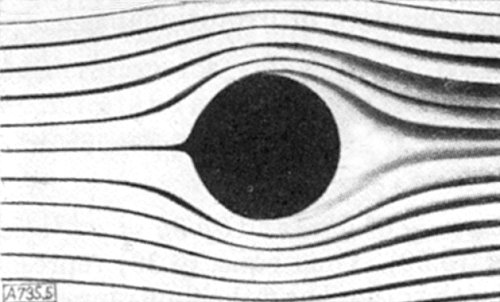
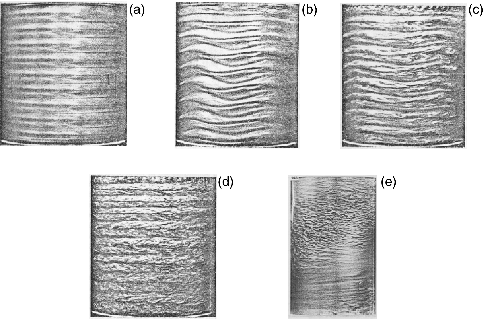
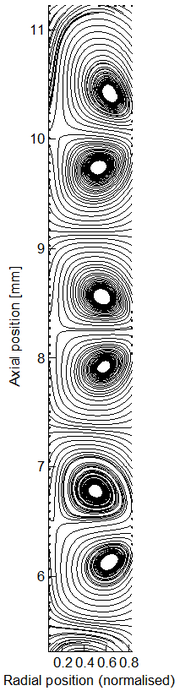
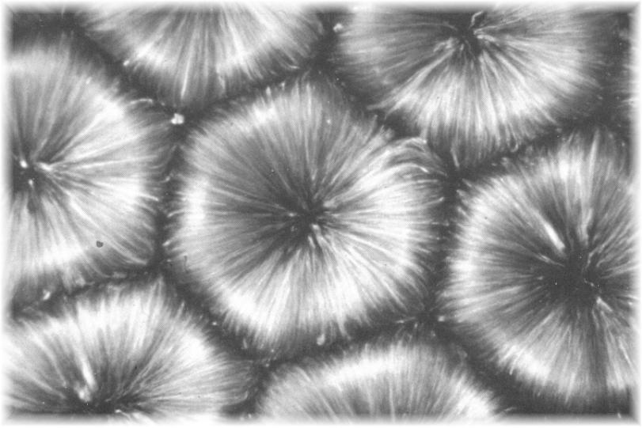

{:toc max_level=3 }

CHE 527 Fluid Flows
Missing lectures: Sept. 27, 29, Oct. 4

* Exams
    
    Midterm: Thursday, Oct 27, 830-1030
    
    Final: Tuesday, Dec 20, 8-10
    
## Lecture 1 

Fluid flows are Driven by

* Pressure gradient
* surfaces (solid and fluid)
* body forces (e.g. gravity)

Flow patterns governed by:

* Reynolds number
* Deborah number
* Weber number
* Froude number
* Strouhal number
* Capillary number
* Marangoni number

### Reynolds number

* Low Reynolds number flow: symmetric around symmetric objects
* vortex can appear in low Reynolds number
* Hele-Shaw Cell: streamline identical to inviscid flow

    

* "angle of attack" affects the flow: large angle induces turbulent boundary layer.
* Taylor-Couette instability

    
    
    Varying in the z-direction of the cylinder

    

* fluid heated from below

    
    
