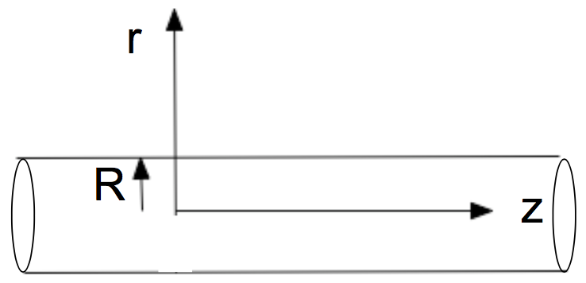
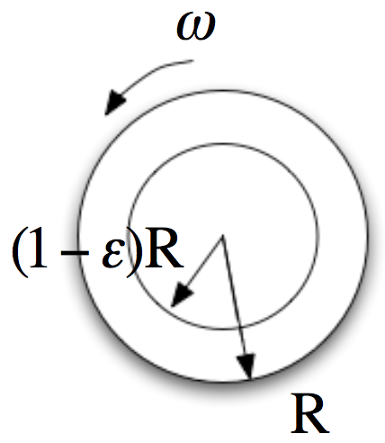

# Lecture 10, Simple Shearing flows

(Deen (2ed): pp. 270-279 (or Deen (1ed): sec 6.1-6.3), Wilkes Chapter 6)

1. Plane Poiseuille Flow
    * *fully developed* flow (*translational invariant* along the flow direction)
    * Hele-Shaw flow (Generalized slit flow) 
        * $\nabla^2\psi=0, \nabla^2\phi=0, v=\nabla\phi$
        * $v=-\frac{K}{\mu}\nabla P, P=-\frac{\mu}{K}\phi$
        * $\nabla^2 P = 0$
    * Inviscid flow (can use Bernoulli)
        * $\nabla^2\psi=0, \nabla^2\phi=0, v=\nabla\phi$
        * $\frac{P}{\rho}+\frac{v^2}{2}=C$
    * Both *Hele-Shaw* flow and *inviscid* flow have **the same streamline** shown in the following picture, but **one is inviscid the other is viscous**, fundamental difference!! They have **different pressure field**.
        
2. Circular Poiseuille flow   
    * Lead to *Hagen–Poiseuille equation*
        
     
3. Flow down an inclined plane
        
        
4. Circular Couette flow

        

    * $v_\theta\approx \omega R x,$ where $x:=(r/R - (1-\epsilon))/\epsilon$ such that $x=0$ and $x=1$ correspond to the inner and outer walls, respectively.

### Example: Single-Screw Extruder 

* Setup: Screw rotates; does not translate 
    
* Change the *Frame of reference* (this is the hard part): Stationary with respect to the screw, with axes directions: 
    * $x$ - perpendicular to the flights; 
    * $y$ - parallel to flight axis;
    * $z$ - normal to the barrel surface
    * model only the metering section
    
    
* Flow normal to the flight axis

    