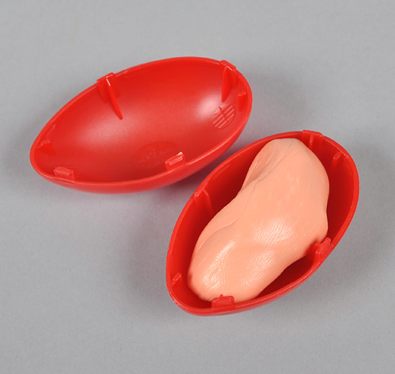
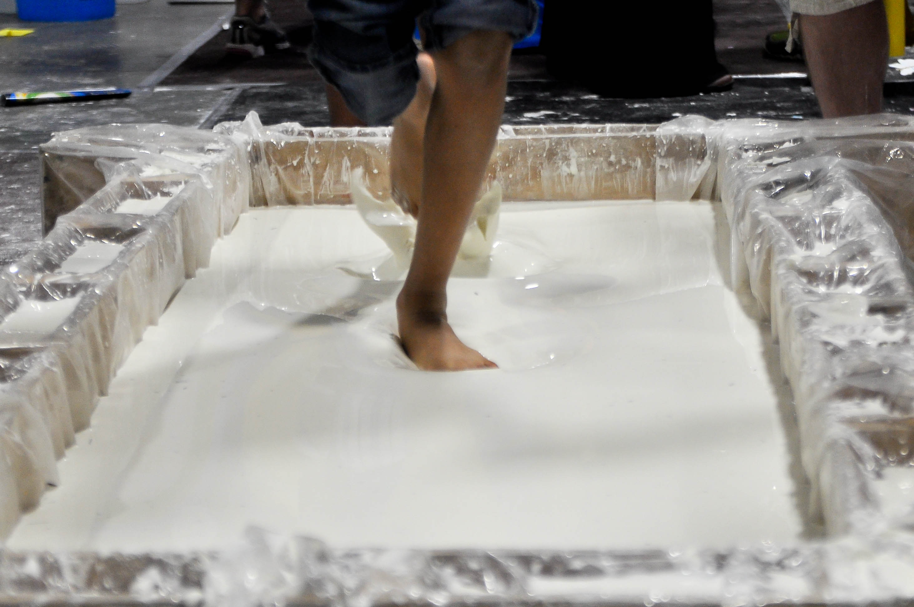
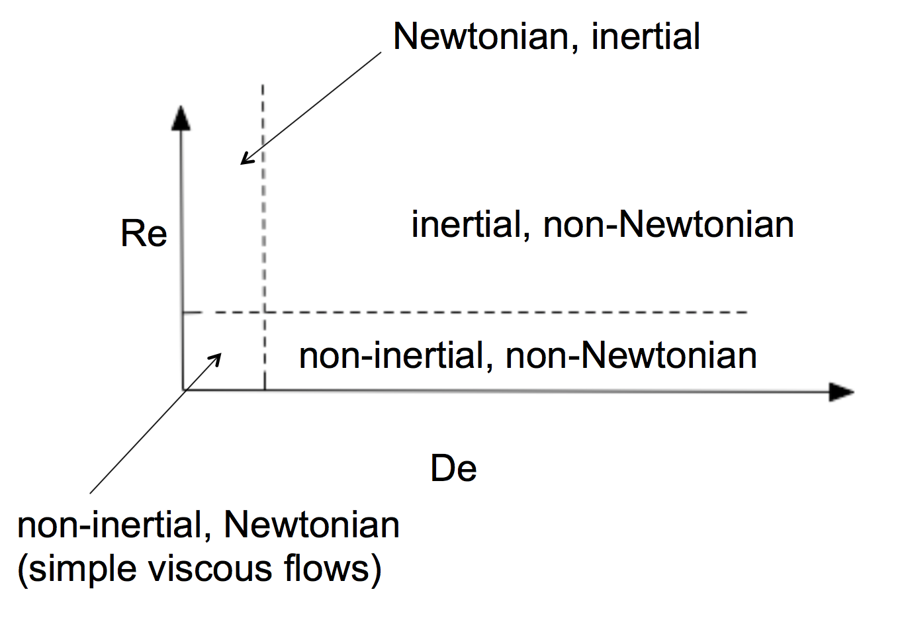

# Lecture 3
(Lecture 2 was about vector calculus, did not record)

## The concept of fluid and solid

#### Some counter-intuitive examples:

- Silly putty:  
    
    looks like solid in short term, can bounce it like a ball. But looks like fluid in long term, if put in a container, a piece of silly putty will flow and take the shape of the container.
- Mayonnaise: 
    
    if a lump of mayo sits there, it won't flow and will stay as it is. But if the same lump of mayo is sheared by a small (but big enough) stress, it will start to deform continuously like a fluid.
- Orbitz (a drink)  
      
    The "beads" in the drink have different density than the fluid. But if the bottle of drink is put stationary, the beads will neither sink nor rise, they just stay in the same position. On the other hand, if you simply shake the bottle, the beads a flowing around in the drink, making it obvious that the drink is fluid. The reason behind this is that, the liquid in the bottle is somehow like the mayonnaise, it requires a certain shear stress to make the drink flow like fluid, otherwise it just stay put like a solid.  
    Glass, on the other hand, is not strictly a solid. The glass has small viscosity in high temperature and can flow, in low temperature, the glass will become (much) harder to deform, but nevertheless can be treated as a "fluid".  
    So, **the Orbitz drink is technically a fluid container holding a solid inside.**
- Corn starch: 
    
    like silly putty, when subject to sudden and huge impact, it behaves like solid; but if sheared slowly, it behaves like fluid and deform continuously.
    
#### Everything is like fluid, just how much

- Deborah number: De $= \tau/t_f$, where $\tau$ is relaxation time (the time required for a fluid to relax, or re-arrange its internal structure), $t_f$ is flow time which equals characteristic dimension $D$ divided by characteristic velocity $U$.
- De $\ll 1$ is liquid like. De $\gg 1$ is solid like.
- When De $\ll 1$ and Re $\ll 1$, viscous Newtonian flow
- For polyethylene at $150$ $C$:  
    De = $\frac{U}{D}\cdot 10^{-20} M^{3.4}$, Re = $UD\cdot 10^{17} M^{-3.4}$ ($M$ is molecular weight)
    - Using the above estimates, assume $D=10^{-1}m$ and $U=10^{-1}m/s$, then if want both De$<1$ and Re$<1$ one must have $3\cdot10^4<M<10^6$
- Using Re and De to classify materials, we get the following diagram  
    