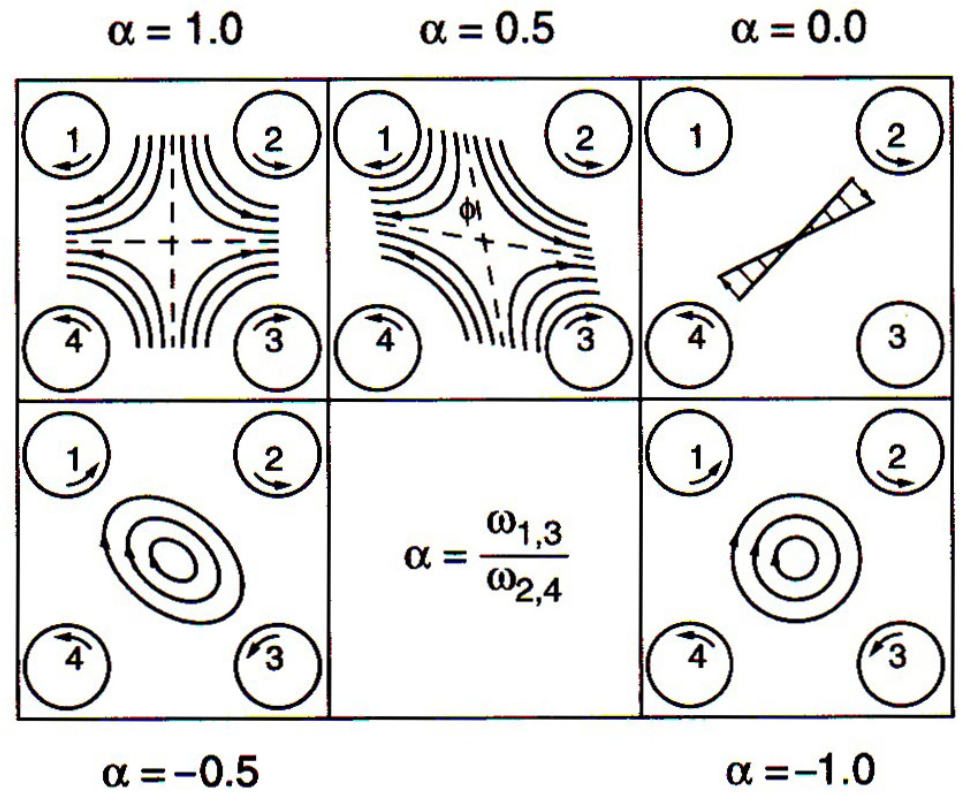

# Lecture 4, Kinematics
(CHE 527 use: Deen, pp. 230-236, 255-260)  
(Bobbie use: Pozrikidis (2011), Chap. 1&2)

Websites for fluid flow images:

- [efluids media gallery](http://media.efluids.com/galleries/all)
- [efluids gallery directory](http://www.efluids.com/efluids/gallery/)

### Velocity gradient

- Taylor expand the velocity field $\mathbf{u}(\mathbf{x},t)$ with respect to $\mathbf{x}$ about $\mathbf{x}_0$, and retaining only the linear term
$$\mathbf{u}(\mathbf{x},t) \approx \mathbf{u}(\mathbf{x}_0,t) + \tilde{\mathbf{x}}\cdot \mathbf{L}(\mathbf{x}_0,t)$$
where the *velocity gradient tensor* is $\mathbf{L} \equiv \nabla\mathbf{u}$.

- Decompose $\mathbf{L}$ into three components: $$\mathbf{L} = \boldsymbol\Xi+\mathbf{E}+\frac{1}{3}\alpha\mathbf{I}$$
where the three parts are

    - vorticity tensor: $$\boldsymbol\Xi \equiv \frac{1}{2}(\mathbf{L}-\mathbf{L}^T)$$
    - rate-of-deformation (or rate-of-strain) tensor: $$\mathbf{E} \equiv \frac{1}{2}(\mathbf{L}+\mathbf{L}^T)-\frac{1}{3}\alpha\mathbf{I}$$
    - $\frac{1}{3}\alpha\mathbf{I}$ is the isotropic expansion (or contraction), where $$\alpha = \text{trace}(\mathbf{L}) = \nabla\cdot\mathbf{v}$$ 
$\alpha$ is also called the rate of expansion or rate of dilatation of the fluid.

#### Example flows

- **shear flow**: $\mathbf{v} = (\dot{\gamma} y,0)$, where $\dot{\gamma}$ is the shear rate. (there are rotations *and* stretches)
- **extensional flow**: $\mathbf{v} = (-x,y)$, there are only stretches.

### Translational Motion: Stream function
(Most useful in 2-D incompressible flows)

- Define $\psi(x,y)$ so that $$v_x = \psi_y\;,\; v_y = -\psi_x$$
- Such definition automatically leads to incompressible $\nabla\cdot\mathbf{v}=0$
- Three "lines"
    - **Path line**: path followed by individual fluid particle (trace the same particle, "contains history info")
    - **Streak line**: curve formed by a succession of particles released from the same point. (emitted from *same point, but different time*.)
    - **Streamline**: curve in space instantaneously tangent everywhere to velocity vector
    - **In steady flow, all three lines are the same.**

- Now consider the rate of change of $\psi$ along a streamline. 
    - $$\delta\psi \propto \mathbf{v}\cdot\nabla\psi = v_x\psi_x+v_y\psi_y=0$$
    - **So $\psi$ is constant along a streamline.**

- Consider the $x$-direction flow rate $q$ through a cross-section bounded by $y_1<y<y_2$
    - $$q = \int_{y_1}^{y_2} v_x\,dy = \int_{y_1}^{y_2} \psi_y\,dy = \psi_2-\psi_1 = \Delta \psi$$
    - **So the flow rate between 2 streamlines is $\Delta \psi$** (difference, not Laplacian)

- Four-roll mill (an apparatus invented by *G. I. Taylor*) below are diagrams depicting the four-roll
    

    