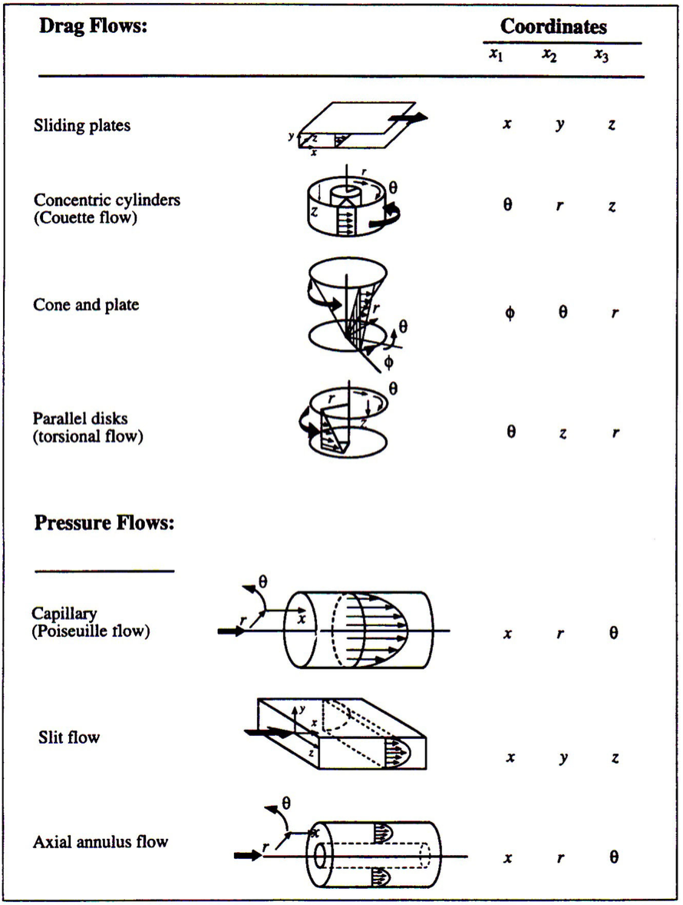

# Lecture 5

#### Deformation Gradient

- needed for solids and viscoelastic liquids
- From time $t'$ to $t$, $\delta\mathbf{x} = \delta\mathbf{x}'\cdot\mathbf{E}(t,t')$, so $$\mathbf{E}(t,t') = \frac{\partial \mathbf{x}}{\partial \mathbf{x}'}$$
- Examples
    - Shear Deformation
      $$\mathbf{E} = \begin{pmatrix}1&0&0\\ \gamma&1&0\\ 0&0&1\end{pmatrix}$$
        - Simple shearing flows:
        
        These are all isotropic (same effect in all direction). (isotropic: air, water, silly putty. anisotropic: wood)
    - Extensional Deformation
      $$\mathbf{E} = \begin{pmatrix}\lambda_1&0&0\\ 0&\lambda_2&0\\ 0&0&\lambda_3\end{pmatrix}$$
- What conditions on $\mathbf{E}$ impose imcompressibility? 
  $$\det\mathbf{E} = 1$$
- How does $\mathbf{E}$ relate to $\nabla\mathbf{v}$? 
  $$\frac{\partial}{\partial t}\mathbf{E} = \frac{\partial \dot{\mathbf{x}}}{\partial \mathbf{x}'}=\frac{\partial \mathbf{x}}{\partial \mathbf{x}'}\cdot \frac{\partial \dot{\mathbf{x}}}{\partial \mathbf{x}}=\mathbf{E}\cdot\nabla\mathbf{v}$$
- Lots of examples of extensional flow (See slides "Lecture 3", stretching, mixing) 
- $\mathbf{E}$ and $\nabla\mathbf{v}$ contain both rotation & stretching info. Rotation of a fluid element does not effect stress.
- Newtonian fluids only affected by $\nabla\mathbf{v}$, **don't care about history, only care about the moment**.
- $\mathbf{E}$ contains info from history
    - How to eliminate effects of past orientations from $\mathbf{E}$ tensor? The "Finger tensor": $$\mathbf{B} = \mathbf{E}^T\cdot\mathbf{E}$$
    - Then can easily derive $$\dot{\mathbf{B}} = (\nabla\mathbf{v})^T\cdot\mathbf{B} + \mathbf{B}\cdot\nabla\mathbf{v}$$

    