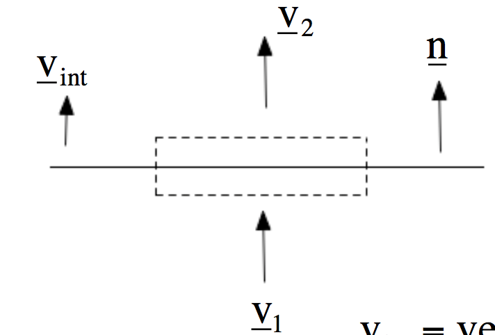
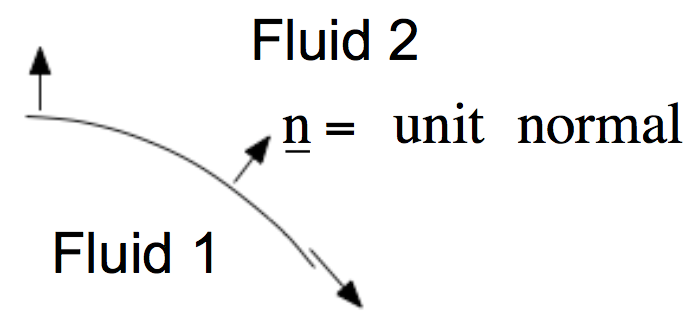
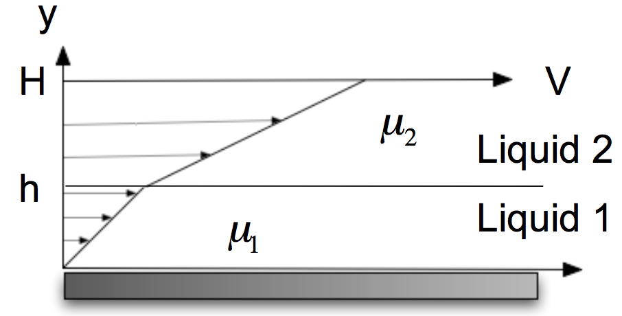
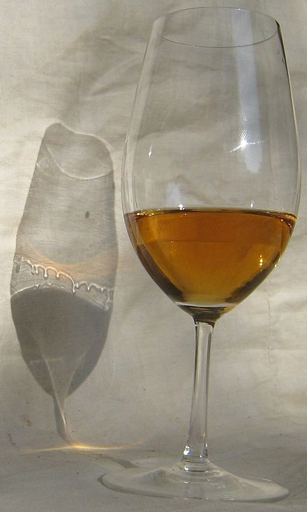

# Lecture 7

(Talked about a homework problem related to Oldroyd-B Fluid at the beginning of class.)

To solve fluid flow problems for constant-density fluid, one needs:

1. The continuity equation
2. the momentum balance equation (in fact, 3 equations involving $\boldsymbol\tau, \mathbf{v}, P$)
3. A constitutive equations for $\boldsymbol\tau$
4. Boundary & initial conditions

*Remark*: $\boldsymbol\tau$ (symmetric) has 6 unknown, $\mathbf{v}$ has 3 unknowns, $P$ is one unknown, need **10 simultaneous equations**.

*Remark2*: If $\boldsymbol\tau$ is explicit in $\nabla\mathbf{v}$, substituting will leave only 4 unknowns, 4 equations.

# Boundary conditions

### Debate over bouyancy

- happened over 400 years ago
- dozens of wealthy spectators gathered in Florence for the debate
- **Galileo** versus **delle Colombe**
- Galileo: buoyancy depends only on *density*
- delle Colombe: buoyancy depends only on shape of the object (misunderstood *surface tension*)

### A weird experiment

- Marangoni flow in a drying octane droplet

### Boudnary conditions

- Need boundary conditions on stress and velocity to solve N-S equation
- These conditions must come from *physical considerations*

1. Continuity of tangential velocity ("no slip")
2. Continuity of normal velocity ("no penetration")

    #### A flow problem: interfacial mass balance
    
    
    
    - mass flux in = $\rho_1 A \mathbf{n}\cdot\mathbf{v}_1$, mass flux out = $\rho_2 A \mathbf{n}\cdot\mathbf{v}_2$
    - Accumulation = $\rho_1 A \mathbf{n}\cdot\mathbf{v}_1 - \rho_2 A \mathbf{n}⋅\mathbf{v}_2 = A \mathbf{n}\cdot\mathbf{v}_{\text{int}} (\rho_1 - \rho_2)$
    - $\mathbf{n}\cdot\left[\mathbf{v}_{\text{int}} (\rho_1 - \rho_2) -(\rho_1\mathbf{v}_1 - \rho_2\mathbf{v}_2)\right] = 0 $
        - Assumption 1: If “1” is liquid and “2” is vapor: $\rho_2 \ll \rho_1 = \rho_L$
        - Assumption 2: Suppose the velocity in phase 2
is due to evaporation only: Replace $\rho_2\mathbf{v}_2$ by $J_{\text{evap}}\mathbf{n}$
        - $\mathbf{n}⋅\mathbf{v}_{\text{int}}  = \frac{\partial h}{\partial t}$, where h is the local height of the surface $$\frac{\partial h}{\partial t} = \mathbf{n}\cdot \mathbf{v}_L - J_{\text{evap}}/\rho_L$$
        - Called the "*kinematic boundary condition*"

3. Stress balance: 
    - with no surface tension: let $\mathbf{s}(\mathbf{n})_i$ be surface force/area on the two sides of the surface $$\mathbf{s}(\mathbf{n})_1 = \mathbf{s}(\mathbf{n})_2 \quad\implies\quad \mathbf{n}\cdot \boldsymbol\sigma_1= \mathbf{n}\cdot \boldsymbol\sigma_2$$
    - stress normal to the surface $= \mathbf{n}\mathbf{n}:\boldsymbol\sigma_1 = \mathbf{n}\mathbf{n}:\boldsymbol\sigma_2$
    - stress tangent to the surface $= \mathbf{t}\mathbf{n}:\boldsymbol\sigma_1 = \mathbf{t}\mathbf{n}:\boldsymbol\sigma_2$
    
    - Newton's 3rd law: principle of equal and opposite forces
    
    #### An example: shear two Newtonian liquids
    
    
    
    - When $y<h$, $\tau_{yx}^1 = \mu_1\frac{dv_x^1}{dy} = \mu_1\dot{\gamma}_1$
    - When $y>h$, $\tau_{yx}^2 = \mu_2\frac{dv_x^2}{dy} = \mu_2\dot{\gamma}_2$
    - When $y=h$, $\mathbf{n} = \mathbf{e}_y$, $\mathbf{t} = \mathbf{e}_x$
    - Stress balance: $\mathbf{t}\mathbf{n}:\boldsymbol\sigma^1 = \mathbf{t}\mathbf{n}:\boldsymbol\sigma^2$ $\implies$ $\mathbf{t}\mathbf{n}:\boldsymbol\tau^1 = \mathbf{t}\mathbf{n}:\boldsymbol\tau^2$ $\implies$ $\tau_{yx}^1 = \tau_{yx}^2$ $\implies$ $\mu_1\dot{\gamma}_1 = \mu_2\dot{\gamma}_2$
    
    There is a jump in shear rate at $y = h$, $\dot{\gamma}_2/\dot{\gamma}_1 = \mu_1/\mu_2 = M$
    
    - No slip boundary condition $\implies$ $v_x^1 = \dot{\gamma}_1 y$ and $v_x^2 = \dot{\gamma}_1 h + \dot{\gamma}_2 (y-h)$

    So $\dot{\gamma}_1 = V/(h+(H−h)M)$
    
    #### What if surface tension is important?
    
    - $\gamma =$ surface tension
    - $\nabla_s \gamma$ gradient of surface tension along surface
    $$\mathbf{s}(\mathbf{n})_1 - \mathbf{s}(\mathbf{n})_2 + \nabla_s \gamma + 2H\mathbf{n}\gamma = \mathbf{0}$$
    Where $H$ is the *mean curvature* at the point
    - **Example:** $P_1 − P_2 = -2H\gamma = \frac{2\gamma}{R}$ for *pressure drop* across a spherical surface
    - General formula for 1D curvature: $$2H(x) = \frac{d^2h/dx^2}{[1+(dh/dx)^2]^{3/2}}$$

#### "tears of wine": Marangoni flow 

- Surface tensions of different fluids are different, evaporation rates are different
- Therefore can see "strange" phenomena like "liquid climbing the wall automatically", or "internal axisymetric tornato"
    