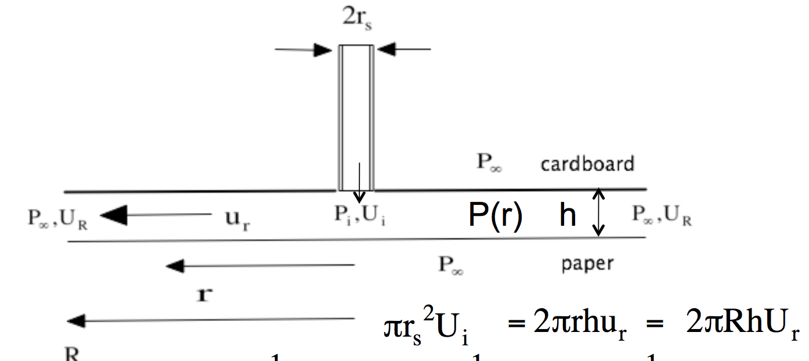

# Lecture 8, Inviscid and Irrotational flows

(Wilkes. pp. 67-96; Chapter 7)

## Euler's equation for inviscid flows

* In the Navier-Stokes equation $$\rho\frac{D\mathbf{v}}{Dt} = \rho \mathbf{g} -\nabla P + \mu \Delta\mathbf{v}$$
* Viscosity $\mu\to0$, same as setting $\Delta\mathbf{v}$ to zero, we get the Euler's equation: $$\rho\frac{D\mathbf{v}}{Dt} = \rho \mathbf{g} - \nabla P$$
* Note that $\mathbf{v}\cdot\nabla\mathbf{v} = \nabla(|\mathbf{v}|^2/2) - \mathbf{v}\times(\nabla\times\mathbf{v})$, so the Euler's equation can be rewritten as $$\frac{\partial\mathbf{v}}{\partial t}-\mathbf{v}\times\boldsymbol{\omega} = -\nabla\left(\frac{P}{\rho} + \frac{|\mathbf{v}|^2}{2}+gz\right)$$
* For steady $\partial/\partial t = 0$ and irrotational flow $\omega = 0$, this becomes the **Bernoulli's equation** $$\nabla\left(\frac{P}{\rho} + \frac{|\mathbf{v}|^2}{2}+gz\right) = \mathbf{0}$$ or $$\frac{P}{\rho} + \frac{|\mathbf{v}|^2}{2}+gz = \text{const}$$

### Example: Generating lift using the Bernoulli principle

* Use Bernoulli's principle, assuming gravity is unimportant in this problem. $$P_i + \frac{1}{2}\rho U_i^2 = P(r) + \frac{1}{2}\rho u_r^2 = P_\infty + \frac{1}{2}\rho U_R^2$$
* Maximum weight of paper that can be lifted $=2\pi\int_0^R (P_\infty- P(r))\,rdr$
* Need mass balance: $2\pi hru_r = 2\pi hRU_R\implies u_r = U_R(R/r)$
* Also need vertical momentum balance:$$2\pi\int_0^R P(r)rdr = P_iA_s+\rho U_i^2A_s + 2\pi\int_{r_s}^R P(r)rdr$$

#### A practice problem

* [amazing bead chain experiment](https://www.youtube.com/watch?v=6ukMId5fIi0&feature=youtu.be)

### D'Alembert's paradox

* Phenomenon:
* How to address the paradox? Take the curl of the incompressible N-S equation, gives the **vorticity equation**: $$\rho\frac{D\mathbf{\boldsymbol\omega}}{Dt} = \rho\boldsymbol\omega\cdot \nabla\mathbf{v} + \mu \Delta\boldsymbol{\omega}$$
* So if initially $\boldsymbol\omega = \mathbf{0}$ in a region of fluid, it must diffuse in from somewhere else.
* If viscosity is high, vorticity diffuses in rapidly, and slowly if viscosity is low

### Vortices

Two types of vortices:

* Forced vortex (rotational)
* Free vortex (irrotational)
* Model any (simple) vortex using N-S equation in *cylindrical coordinate*, only $v_\theta\neq 0$ and only depends on radial distance $r$ from the center of the vortex, so the N-S equation becomes $$-\rho\frac{v_\theta^2}{r} = -\frac{\partial P}{\partial r}\qquad\qquad \frac{\partial }{\partial r}\left(\frac{1}{r}\frac{\partial (rv_\theta)}{\partial r}\right) = 0$$
* Forced vortex: $v_\theta = r\omega$
* Free vortex: $v_\theta = c/r$ (like *hurricane*)

### Is the N-S equation frame-invariant?

* Is there any effect of a rotation of frame on the stress or pressure? (Yes! The *Coriolis force* and *centrifugal force*!)
* In a rotating frame, a vector $\mathbf{v}$ is going to be changing within the frame: $$\mathbf{v} = \hat{\mathbf{v}}\cdot\mathbf{Q}(t)$$ where $\mathbf{Q}(t)$ is the tensor that describes the rotational motion of the frame with respect to the inertial frame.
* Then the inertia term in the N-S equation becomes: $$\frac{D\mathbf{v}}{Dt} = \frac{D\hat{\mathbf{v}}}{Dt}\cdot\mathbf{Q}+2\boldsymbol\omega\times\hat{\mathbf{v}}\cdot\mathbf{Q}+\boldsymbol\omega\times(\boldsymbol\omega\times\hat{\mathbf{r}})\cdot\mathbf{Q}$$ In the above equality, we identify the **Coriolis force** (stress): $2\boldsymbol\omega\times\hat{\mathbf{v}}$, and the **centrifugal force** (stress): $\boldsymbol\omega\times(\boldsymbol\omega\times\hat{\mathbf{r}})$.
* So the N-S equation in a rotating frame (steady rotation) is $$\frac{D\hat{\mathbf{v}}}{Dt} = \hat{\mathbf{g}} - \frac{1}{\rho}\hat{\nabla P}-2\boldsymbol\omega\times\hat{\mathbf{v}} - \boldsymbol\omega\times(\boldsymbol\omega\times\hat{\mathbf{r}})+ \hat{\nabla}\cdot\hat{\boldsymbol\tau}$$ Note that the constitutive equation $\hat{\nabla}\cdot\hat{\boldsymbol\tau}$ is frame-invariant, but the inertia is not.