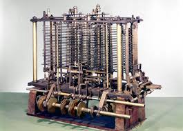
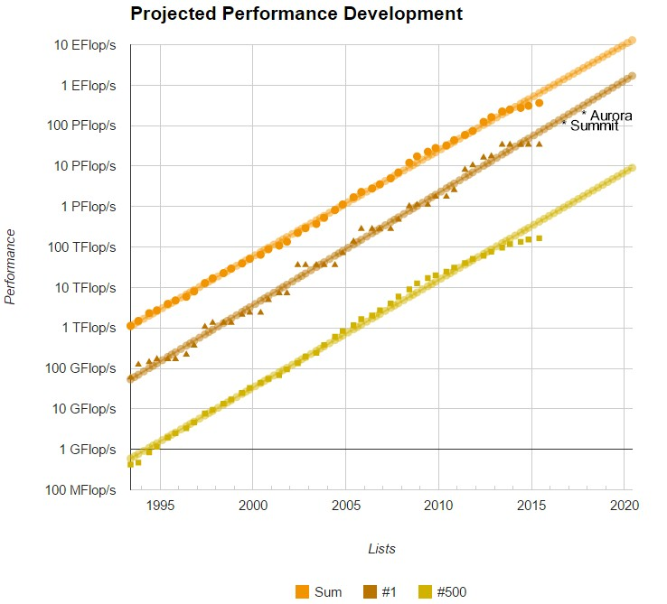

#### Origins of computing (pre-1900)
- **Charles Babbage** designs the "analytical engine"
    

#### Early History (1900-1950)
- Alan Turing (English)
- Konrad Zuse (German)
- Machines:
    - Zuse Z3(Germany,1941)
    - Colossus(UK,1944)
    - ENIAC(US,1946)

#### History (1950-1980): IBM
- System/360(e.g. "Mainframe")
- Controlled the market on peripheral devices

#### History (1950-1980): Cray
- Engineering Research Associates (ERA)
- Control Data Company (CDC)
- Cray
    - Eventually Samuel Cray starts his own company
    - producing the fastest computers in the world

#### Moore's Law
- The number of transistors on a microprocessor will double every 18 months

#### History (1980-2000)
- Cray supercomputers: primary platfrom for hpc in the 80s
- Desktop/Workstations start get a foothold as Moore's Law continues
- Foundations of modern HPC begin to appear in the 90s

#### Dennard's Scaling (1972)
- Voltage and Current are proportional to linear dimensions of a transistor
    - However power is proportional to transistor area
- Dennard scaling ignored "leakage current" and "threshold voltage"
    - Scaling ended in ~2006
    - Practical clock speeds limited to 4 GHz

#### Processor-DRAM Gap (latency)
- Processor-Memory Performance Gap: (grows 50%/year)

#### Present (2000-2016)
- A somewhat stable period of growth
- Power density begins to limit serial performance
- However, Moore's law continues (in an altered form) (multicore)
- Heterogeneous architectures begin to appear
    - NVIDIA GPUs
    - Intel MICs
- Multicores supercomputing

#### TOP500 list
- Yardstick: Rmax of LINPACK
    - Solve $Ax=b$, dense problem, matrix is random
- List is updated twice a year
- All info available: <https://www.top500.org>
    
    
#### HPC in the next decade (Exascale)
- Gigahertz-Kilocore-Meganode = Exascale
    - $10^9\times10^3\times10^6=10^{18}$
- We have GHz processors: Intel Xeon, 2.x GHz
- We *almost* have Kilocore nodes: NVIDIA 192 cores (2048 threads)
- What about Meganode clusters: not quite there, 18,688 nodes

#### Energy to operate supercomputer
- Today's power costs
    - DP- double precision
    - FMADD
- Remember that a pico ($10^{12}$)

#### Koomey's Law
- Relates computation to energy
    - Observed exponential behavior
- "at a fixed computing load"

#### Third pillar of science
- Why super computing: theory, experiment and **computing**

#### What are people doing with HPC?
- Finite state machine
- combinational
- graph traversal
- structured grid
- dense matrix
- sparse matrix
- fft

motifs in HPC

## Intro to Linux

#### background
- Linux is *the* open-source OS
- Dominates the HPC world as the de-facto OS
- Generally preferred by programmers & developers

#### The Shell
- The linux human-machine interface
    - command line
- Numerous types of shells
    - Bourne Shell (sh)
    - Bourne-Again Shell (bash)
    - Kron Shell(ksh)
    - C Shell (csh)
    - TENEX C shell (tcsh)
    
#### The environment
- defined by environment variables
- some common environment variable: $PATH
- How to RTFM: use follwoing commands
    - info
    - man
    - help
    - command options: -h,--h,-help,--help

#### Navigating servers
- commands: ssh, scp, sftp, rsync, wget