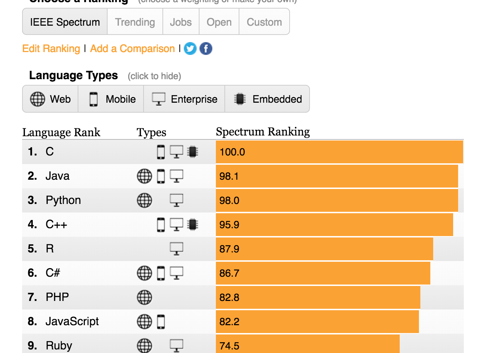

# Lecture 2, 09/12/16

#### Programming languages
- Statistics: <http://spectrum.ieee.org/static/interactive-the-top-programming-languages-2016>

#### Types of Programming Language
- Markup language (HTML, XML)
- Scripting language (MATLAB, Python, Bash)
- High level language (C/C++, Fortran, Java)
- Low level language (Assembly 汇编语言)

#### What Programming Languages do
- Variable declaration (double, char, programmer defined types)
- Operators (+, -, etc)
- Execution control constructs (for, while, if)
- Memory management (automatic)

#### Pointers
- Difficult to grasp if new to programming
- In high-level programming languages variable names are associated with memory
- Variables that are defined as pointers can "point" to different memory locations and often don't have their own associated memory
- If a block of memory loses all references, this is a *memory leak*. (no pointer points to the memory, can't change it anymore) (this is bad! more on this later)

#### Brief History of Fortran
- developed 1950's 
- FORTRAN = FORmula TRANslation (designed for scientific computing)
- Used *punch cards* at first
- FORTRAN 66 (1966) - first "standardized" Fortran
- FORTRAN 77 (1977( - what most people think of when they hear "Fortran"
- FORTRAN 90/95 (caught up to features in C)
- Fortran 2003/2008 - *modern* Fortran
    - object-oriented (caught up to C++, though not quite) 
    - still not fully supported by compilers

#### Useful links for Fortran programming
- Output formatting: [Fortran Formats](http://www.cs.mtu.edu/~shene/COURSES/cs201/NOTES/chap05/format.html)
- Dr. C-K Shene 的 [Fortran 90 Tutorial](http://www.cs.mtu.edu/~shene/COURSES/cs201/NOTES/fortran.html) (非常有用)
