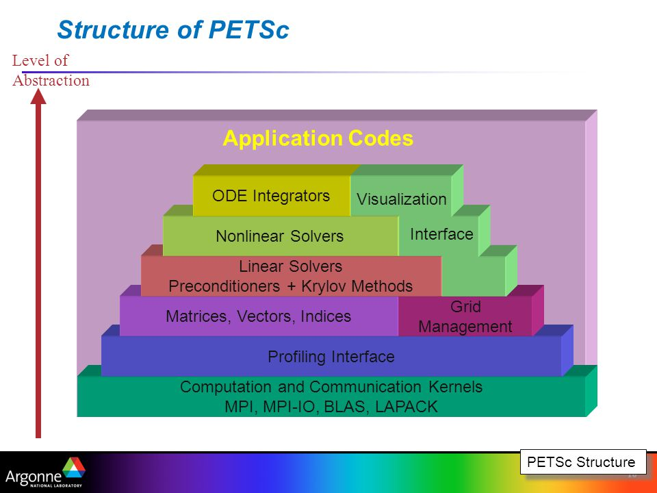

# Lecture 7, Scientific Computing packages/libraries

#### BLAS (Basic Linear Algebra Subprograms)

- BLAS is a (Fortran) programming interface to low-level linear algebra routines
- Examples: BLA operations:
    - Dot products, addition, scalar multiplication
    - Mat-vec multiplication
    - Mat-mat multiplication
- Why BLAS?
    - BLAS codes run much **faster** than hand-written version code.
- Classification of BLAS operations:
    - BLAS-1 operations: routines involving only *vector operations*
    - BLAS-2 operations: *matrix-vector operations*
    - BLAS-3 operations: *matrix-matrix operations*

#### LAPACK (Linear Algebra PACKage)

- <http://www.netlib.org/lapack/explore-html/>
- LAPACK is a collection of (Fortran) functions that can hel you solve Linear Algebr problems *based on BLAS routines*
- LAPACK solves
    - Ax=b
    - least-sqaures solutions
    - eigenvalue problems
    - singular value problems
- LAPACK routines
    - Simple driver routines
    - Expert driver routines (same as Simple, but more options)
    - Computational driver routines (mainly for LAPACK internel use)
- Naming convention of LAPACK: XYYZZZ (X = type of problem, YY = matrix types, ZZZ = computation performed) 
- Calling LAPACK and BLAS from C, C++: use extern function to declare the routines

    ```c++
    extern "C"{
    void dcopy_(blah blah inputs)
    }
    
    void main{
    dcopy_(blah blah inputs)
    }
    ```
    
#### PETSc (Portable Extensible Toolkit for Scientific computing)

- PETSc is written in C language
- PETSc help developing parallel, nontrivial PDE solvers that deliver high performance.
- Philosophy: Everything has a plugin architecture
    - Vector, Matrix, Partitioning
    - Preconditioner, Krylov methods
    - Nonlinear solver
    - Spatial
    
- PETSc vectors: fundamental datatypes of PETSc
    - Example creating vector: `VecCreate(MPI_Comm, Vec *)`, `VecSetSizes(Vec, int n, int N)` (local size, global size)
    - Vector operations: `VecDot()`, `VecNorm()`, `VecScale()`
- PETSc matrices: both dense and sparse matrices are handled parallel.
    - Example creating matrix: `MatCreate(MPI_Comm, Mat *)`, `MatSetSizes(Mat, int m, int n, int M, int N)` (local and global sizes)
- Iterative solvers:
    - PETSc KSP (Krylov Subspace Problems): CG, BiCG, GMRES
    - preconditioners: block Jacobi, SOR, Multigrid, field-split
    - Nonlinear solvers (SNES)

#### TRILINOS

- Trilinos is written in C++
- Trilinos is more extensive collection of packages than PETSc
- More extensive than PETSc and more complex to use