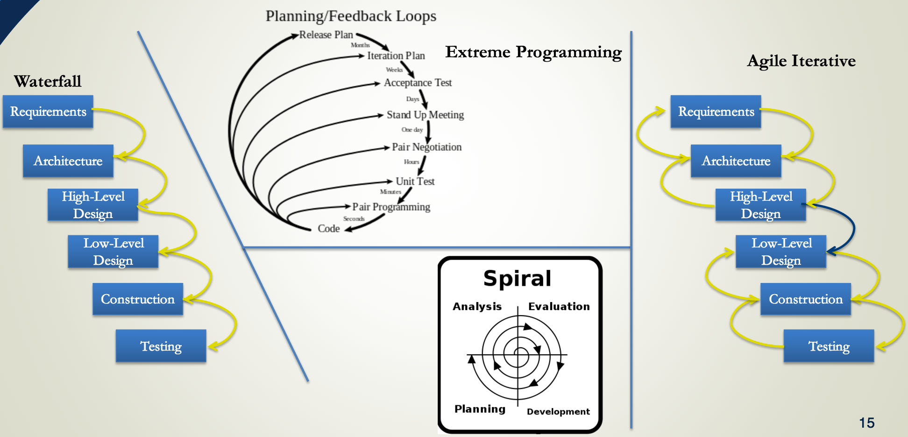

# Lecture 9 Software Engineering Practices & Development Workflows

## Overview of software Engineering

### Metaphors in writing software

- "science", "art", "process", "game", farming, hunting werewolves, or drowning with dinosaurs in a tar pit"

- Things needed for simple structures may not work for large structures
- simple projects may not need a lot of planning
- don't build things you don't have to

## Components in the development process
### Software "construction"

- Software construction includes: mainly coding and debugging, but also other things like unit testing
- construction is the central part of any software project
- Parts of software construction:
    - *Problem-definition* (problem statement is the foundation based on which everything follows)
    - *Requirements*, 
        - usually describe functional requirements: input, output, error handling, (sometimes also includes performance goals, solution algorithms)
        - **requirements always change**
        - pitfalls: requiremnets need not state the solution methodology (e.g. algorithm), i.e., no coding-level requirements
    - *Architecture* (highest level design)
        - key practice: consider multiple designs (develop more than one solution and compare them)
        - pitfall: architecture shouldn't specify pramgramming language to use
    - *High level design*
        - includes detailed design documentation (for API, class definitions, dependencies within different parts of the program, state diagrams, sequence diagrams, flow-charts)
        - key practices: multiple designs. unified modeling language (UML)
        - pitfalls: difficult to keep up to date; create unnecessary dependencies.
    - *Low level design* (design that takes place "behind" an interface)
        - terms: "under the hood", some choice of algorithm
        - key practice: get very detailed requirements when you can, defensive programming
        - Pitfalls: poor performance, memory leaks, unnecessary dependencies, bugs (example: branching (like if-clause) inside a for-loop would prohibit compilers to optimize the loop)

## development cycle workflows

### development workflows

- workflows are *based on a particular philosophy* or approach to software development.
    - *Waterfall*: once through and you're done
    - *Incremental*: perform the smae tasks in cycles
    - *Iterative*: example, Agile: work in a way that lets you adapt quickly
    - *Lean*: don't do more than you need to. minimize "waste". Example: Kanban (日文:看板)
- No right or wrong workflow; but some workflows will be more productive than others for certain projects in certain situations
- Reference: [Wikipedia: software development process]()

- Other workflow concepts
    - Scrum: an *iterative* and *incremental* **agile software development** framework for managing product development
    - Scrum & Kanban (日文:看板)
    - Test Driven Development: key is "unit testing" (逐个单元测试)
- Final comment: using *workflows* is like using *version control*, it's only as good as the user.

## A taxonomy of testing

- Testing is the **backbone** of *software quality assurance* (SQA)
- Types of testing
    - Unit testing: test individual units of program in isolation, should run very fast (< 1 sec)
    - Integral testing: testing program components together, should run fast (< 1 min)
    - Regression testing: test whole program for changes in program output, should run fast (< 1 min ~ a couple mins)
    - Verification testing: test that you are "doing things right", can happen at unit of itegral or regression level. Comparison analytic solutions or manufactured solutions.
    - Validation testing: whole program testing "doing the right thing", simulating reality, comparison to experiment
    - Memory (Valgrind) testing
    - Coverage testing
- Other types of testing exist.
- **Automate testing as much as possible!**

## Lifecycle of software

### Software Lifecycle model

#### What is it?
- The model *used to decide when* to perform particular development activities
- implicit to all software projects (not necessarily formally defined)
- much better to have a formally defined lifecycle model
    - will define "maturity levels"
    - also defines what activities to perform at each level

#### What should a lifecycle model do?

- Allow exploratory research to remain productive
- Enable reproducible research
- Improve overall development productivity
- Improve production software quality
- Communicate maturity levels more clearly to customers

**As much as 75% or more of total cost in a software project can be maintenance!**

turns into spaghetti